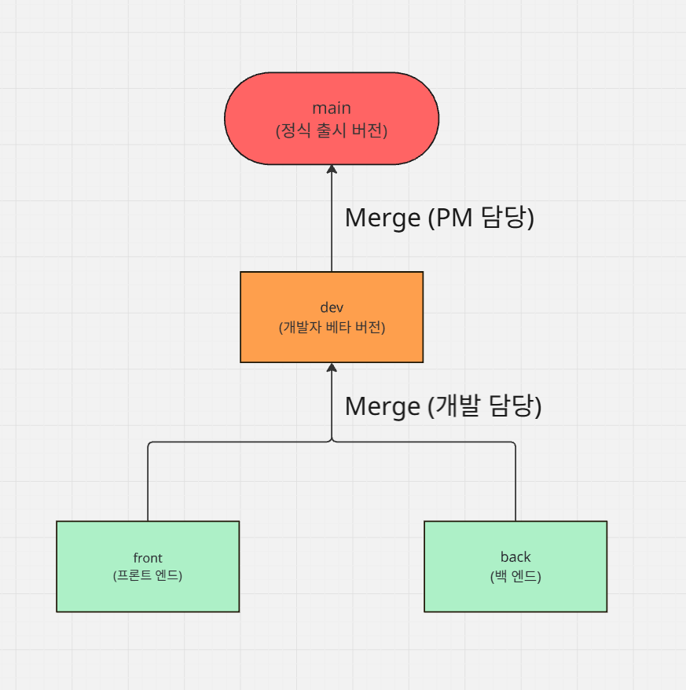

# SW 프로젝트 : Today-Schedule-Manager (TSM)
개발 환경 구성 및 개요


- 기술 스택 선정
- MVP 설계
- 프로젝트 구조
- Git-Flow

## 🛠️ 1. 기술 스택 선정
- 프론트엔드 : React
```
컴포넌트 기반 아키텍처: UI를 재사용 가능한 작은 부품(컴포넌트)으로 만들 수 있어,
코드의 유지보수가 매우 쉽고 효율적임

가장 큰 장점은 바로 코드 재사용(컴포넌트화) React Native를 사용하면 한 번 작성한 코드를 iOS와 안드로이드 두 플랫폼에 모두 사용할 수 있음. 이는 개발 시간과 비용을 크게 절약해 줌.
```
- 백엔드 : Node.js + Express.js
```
비동기 처리: Node.js는 비동기 처리에 매우 뛰어남 AI API를 활용한 서비스를 운영할 때, 외부 API의 응답을 기다리는 동안 다른 요청을 동시에 처리할 수 있어 서비스의 성능이 향상됨

확장성: Node.js는 작은 프로젝트부터 대규모 서비스까지 유연하게 확장할 수 있는 구조를 가지고 있어, 지금의 목표를 달성하고 수익이 커져도 계속 사용할 수 있음
```
- DB : MongoDB
```
뛰어난 유연성: MongoDB는 데이터의 구조가 고정되어 있지 않은 문서(Document) 형태로 데이터를 저장함 프로젝트 초기 단계에서는 데이터 구조가 자주 바뀔 수 있는데, MongoDB는 이런 변화에 매우 유연하게 대처할 수 있어 개발 속도를 높여줌.

JavaScript와의 호환성: JSON과 유사한 형식으로 데이터를 저장하고 다루기 때문에, JavaScript 기반인 Node.js와 완벽하게 호환됨. 별도의 변환 과정 없이 데이터를 주고받을 수 있어 개발이 훨씬 편리해짐.
```

## 📕 2. MVP 설계
- MoSCoW 원칙 사용
  

  - Must  **<9월 목표>**
    - 로그인 기능,
    - 스케줄 작성,
    - 사용자 정보 + 일정 정보 DB연동
  - Should **<10월, 11월 목표>**
    - 스케줄에 따른 추천 시스템 작성
    - 사용자 정보 암호화
    - 서비스 배포
  - Could 
    - 조직단위 스케줄 관리 시스템 작성
    - 스케줄 공유 기능 구현
    - 서비스 수익화
    - AI 비서 서비스 도입
  - Won't
    - 아직 미정
  

## 🧷 3. MVC 디자인 패턴 초안 (디렉토리 구조)


-프론트 엔드
```
ex) 설명 예시 (파일은 무시해도 됨.)

# View

client/
├── src/
│   └── App.jsx
│
├── publc/
│
├── components/      # UI 컴포넌트 (View)
│   ├── WeatherCard.jsx
│   └── ScheduleList.jsx
├── pages/          # 페이지 (View)
│   ├── HomePage.jsx
│   └── DashboardPage.jsx
└── services/       # API 호출 (Backend MC와 통신)
    └── weatherService.js

추후에 src 폴더에 components 통합시킬 수 있음.
```
- 백엔드
```
ex) 설명 예시 (파일은 무시해도 됨.)

# Model + Controller

server/
├── models/          # Model (M)
│   ├── User.js
│   └── Schedule.js
├── controllers/     # Controller (C)  
│   ├── userController.js
│   └── weatherController.js
└── routes/          # Router (API 엔드포인트)
    ├── users.js
    └── weather.js
```


## 📌 4. Git-Flow

브랜치 설명
- main : 정식 출시가 가능한 병합된 코드를 배포하기 위한 branch
- dev : front 작성 코드 + back 작성 코드를 병합하기 위한 branch
- front : 프론트엔드 개발 코드를 위한 branch
- back : 백엔드 개발 코드를 위한 branch

**(추후에 개발환경에 따라 front, back의 하위 branch를 추가적으로 생성 할 수 있음.)**



